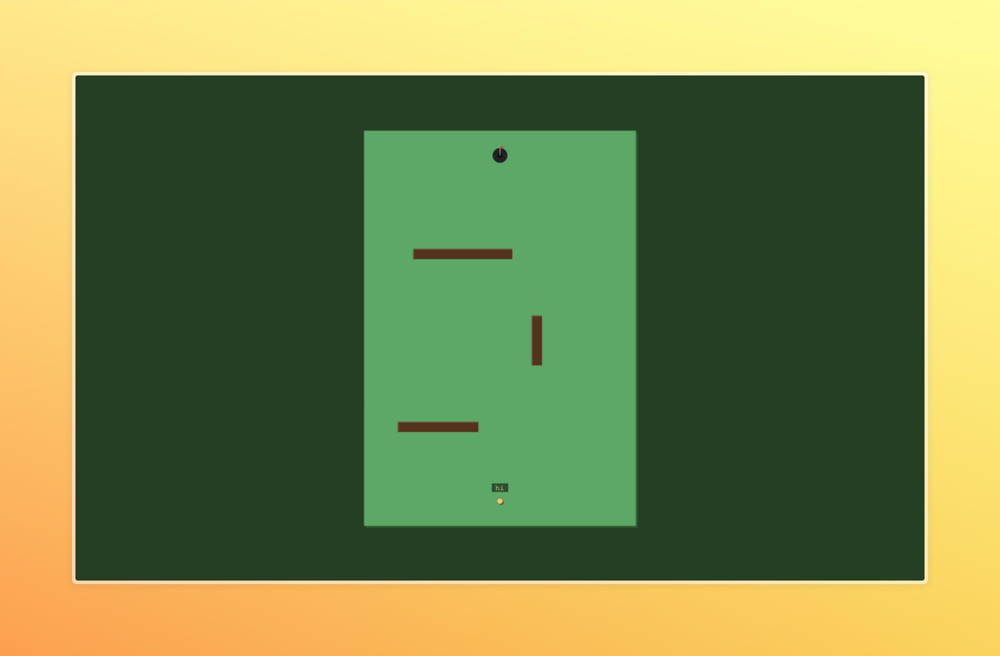

# socket-golf ⛳

Multiplayer real-time mini-golf with physics-based gameplay, room codes, and zero accounts.



## Features

- **Real-time physics** — Matter.js with Verlet integration, bounce, friction, and collision detection
- **Parallel play** — Everyone plays the same hole simultaneously; see other players' balls and nametags moving in real-time
- **Room codes** — Create a room, share the 6-char code, friends join — no login, no accounts
- **Camera controls** — Drag to pan, scroll to zoom, click the ball to aim
- **Aim line** — Pull back from the ball to see a dotted forward trajectory that scales with power
- **3 holes** — Vertically designed courses (bottom-to-top) with unique wall layouts and pars
- **Ready system** — All players must ready-up before advancing to the next hole
- **Persistent scoring** — Stroke tracking per hole with par-relative final scores

## Quick Start

```bash
# Install dependencies
npm install

# Start both server + client in dev mode
npm run dev
```

- Server runs on `http://localhost:3001` (Socket.io)
- Client runs on `http://localhost:5173` (Vite dev server)

## Project Structure

```
socket-golf/
├── shared/          # Shared types, Zod schemas, message protocol
│   └── src/messages.ts
├── server/          # Node.js + Socket.io game server
│   └── src/index.ts
├── client/          # Phaser 3 + Vite frontend
│   ├── src/
│   │   ├── main.ts              # Phaser config, boot
│   │   ├── network.ts           # Socket.io client, global state
│   │   ├── physics.ts           # Ball physics helpers (impulse, velocity)
│   │   └── scenes/
│   │       ├── LobbyScene.ts     # Room creation, join, player list
│   │       ├── GameScene.ts      # Core gameplay, camera, aiming
│   │       └── ScoreboardScene.ts # Hole scores, ready check
│   └── public/courses/
│       ├── hole1.json
│       ├── hole2.json
│       └── hole3.json
```

## How to Play

1. Open the client in a browser
2. Enter your name and **CREATE ROOM** or **JOIN** with a 6-character room code
3. The room creator sees a **START GAME** button (requires 2+ players)
4. Once started, all players are placed on the first hole
5. **Drag empty space** to pan the camera, **scroll** to zoom
6. **Click and drag from the ball** to aim — a dotted forward line shows the trajectory
7. **Release** to shoot; the line's length determines power
8. Finish the hole, then click **I'M READY** when everyone's ready for the next hole
9. Lowest total strokes across 3 holes wins

## Tech Stack

| Layer | Technology |
|---|---|
| Rendering | Phaser 3 (Canvas) |
| Physics | Matter.js (via Phaser) |
| Networking | Socket.io (WebSocket) |
| Runtime | Node.js + Bun |
| Build | Vite, TypeScript |
| Validation | Zod |

## Scripts

```bash
npm run dev       # Start both server + client
npm run dev:server  # Server only
npm run dev:client  # Client only
npm run build     # Production build
npm run lint      # Type-check all packages
```

## License

MIT
